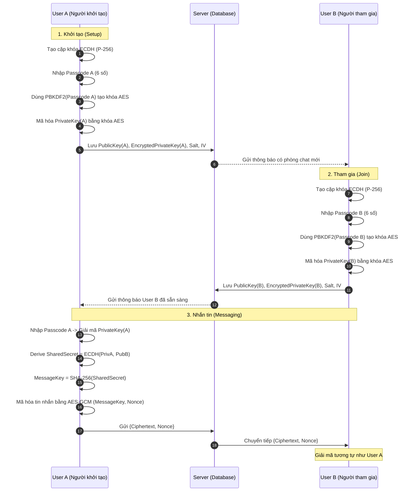

# 🔐 Ứng dụng Web Mật mã học

Ứng dụng web tích hợp các thuật toán mật mã hiện đại, xây dựng bằng Python Flask.

## ✨ Tính năng chính

| Tính năng                            | Thuật toán mật mã                             |
| ------------------------------------ | --------------------------------------------- |
| Xác thực người dùng                  | **Bcrypt** + Pepper                           |
| Ký số file tự động khi upload        | **RSA-2048 PSS** + SHA-256                    |
| Xác thực chữ ký số                   | **RSA-2048 PSS** + SHA-256                    |
| Chat đầu cuối mã hóa (E2EE)          | **ECDH P-256** + **AES-256-GCM** + **PBKDF2** |
| Chia sẻ file (công khai / riêng tư)  | —                                             |
| Quản trị người dùng & Reset mật khẩu | **Bcrypt**                                    |
| Hệ thống thông báo                   | —                                             |

## 🛠️ Công nghệ sử dụng

- **Backend:** Python 3, Flask, Flask-SQLAlchemy
- **Frontend:** Jinja2, Bootstrap 5, JavaScript (Web Crypto API)
- **CSDL:** SQLite 3
- **Mật mã phía server:** `bcrypt`, `cryptography` (RSA, PSS, SHA-256)
- **Mật mã phía client:** Web Crypto API (ECDH, AES-GCM, PBKDF2)

## 📁 Cấu trúc dự án

```
├── app.py                      # Khởi tạo Flask, đăng ký Blueprint
├── create_db.py                # Tạo CSDL và dữ liệu mẫu
├── models/
│   ├── user_model.py           # User (có RSA keys)
│   ├── file_model.py           # File (có signature)
│   ├── chat_model.py           # Conversation, Message (E2EE)
│   └── notification_model.py   # Notification
├── routes/
│   ├── auth_routes.py          # Đăng nhập, đăng xuất
│   ├── admin_routes.py         # Quản trị user, file, reset PW
│   ├── file_routes.py          # Upload, chia sẻ, ký số file
│   ├── chat_routes.py          # Chat, E2EE handshake
│   ├── verify_routes.py        # Xác thực chữ ký số
│   ├── profile_routes.py       # Hồ sơ, đổi mật khẩu
│   ├── home_routes.py          # Trang chủ
│   └── notification_routes.py  # Thông báo
├── utils/
│   ├── hash_utils.py           # Bcrypt: hash_password, check_password
│   ├── crypto_utils.py         # RSA: generate_keys, sign_data, verify_signature
│   ├── auth_decorators.py      # @login_required, @admin_required
│   └── upload_file.py          # Xử lý upload file
├── templates/                  # Giao diện HTML (Jinja2 + Bootstrap 5)
├── uploads/                    # Thư mục lưu file upload
└── instance/                   # SQLite database
```

## 🚀 Cài đặt và chạy

### 1. Cài đặt thư viện

```bash
pip install flask flask-sqlalchemy bcrypt cryptography
```

### 2. Tạo cơ sở dữ liệu

```bash
python create_db.py
```

Lệnh này sẽ tạo CSDL với 3 tài khoản mặc định:

| Username | Password | Role  |
| -------- | -------- | ----- |
| `admin`  | `123`    | Admin |
| `user1`  | `123`    | User  |
| `user2`  | `123`    | User  |

Mỗi tài khoản được tự động sinh cặp khóa RSA-2048.

### 3. Chạy ứng dụng

```bash
python app.py
```

Truy cập: [http://localhost:5000](http://localhost:5000)

## 🔑 Chi tiết kỹ thuật mật mã

### Bcrypt + Pepper (Mã hóa mật khẩu)

- Pepper = 3 ký tự đầu username, ghép vào trước password trước khi băm.
- Bcrypt tự tạo salt 128-bit, cost factor mặc định = 12.

### RSA-PSS (Chữ ký số)

- Key size: 2048-bit, Public exponent: 65537.
- Padding: PSS với MGF1(SHA-256), salt length = MAX.
- File upload → tự động ký → lưu signature Base64 → download file `.sig`.

### E2EE Chat (ECDH + AES-GCM)

- **Trao đổi khóa:** ECDH trên đường cong P-256 (secp256r1).
- **Mã hóa tin nhắn:** AES-256-GCM với IV 96-bit ngẫu nhiên.
- **Bảo vệ private key:** PBKDF2 (100.000 iterations, SHA-256) → AES-GCM encrypt.
- **Zero-knowledge:** Server chỉ lưu ciphertext, không bao giờ biết plaintext.

---

## 🔐 Chi tiết luồng hoạt động E2EE

Tính năng chat bảo mật (End-to-End Encryption) đảm bảo rằng chỉ người gửi và người nhận mới có thể đọc được nội dung tin nhắn. Server đóng vai trò là trung gian lưu trữ và chuyển tiếp các gói tin đã mã hóa mà không thể giải mã chúng.

### 1. Sơ đồ luồng hoạt động (Sequence Diagram)

Sơ đồ dưới đây thể hiện quy trình từ lúc khởi tạo phòng chat đến khi trao đổi tin nhắn giữa User A và User B:



### 2. Quy trình mã hóa chi tiết

#### Bước 1: Bảo vệ Khóa bí mật (Private Key Protection)
Thay vì lưu Private Key dưới dạng plaintext hoặc chỉ lưu ở client (dễ mất), ứng dụng mã hóa nó bằng một **Passcode** do người dùng tự đặt.
- **Thuật toán:** PBKDF2 with SHA-256.
- **Số vòng lặp:** 100,000.
- **Dữ liệu lưu vào DB:** `encrypted_private_key`, `salt`, `iv`.

#### Bước 2: Thỏa thuận khóa (Key Agreement)
Sử dụng giao thức **Diffie-Hellman trên đường cong P-256 (ECDH)** để thiết lập một bí mật chung (Shared Secret) mà không cần gửi bí mật đó qua mạng.
- Hai bên trao đổi `PublicKey` công khai.
- `SharedSecret = ECDH(MyPrivateKey, OtherPublicKey)`.
- Khóa mã hóa tin nhắn thực tế (`MessageKey`) được băm từ bí mật này bằng **SHA-256**.

#### Bước 3: Mã hóa tin nhắn (Message Encryption)
- **Thuật toán:** AES-256-GCM (Galois/Counter Mode).
- **Tính năng:** Cung cấp cả tính bảo mật (Confidentiality) và tính toàn vẹn (Integrity).
- **Nonce (IV):** 96-bit ngẫu nhiên cho mỗi tin nhắn để đảm bảo cùng một nội dung sẽ có bản mã khác nhau mỗi lần gửi.

### 3. Lưu trữ tại Cơ sở dữ liệu (Database)

| Bảng | Trường dữ liệu | Mô tả |
| :--- | :--- | :--- |
| **Conversation** | `public_key_a/b` | Khóa công khai ECDH của 2 user (dạng SPKI Base64) |
| | `encrypted_private_key_a/b` | Khóa bí mật đã mã hóa bằng passcode (dạng PKCS#8 Base64) |
| | `salt_a/b`, `iv_a/b` | Tham số dùng cho PBKDF2 và mã hóa Private Key |
| **Message** | `content` | **Ciphertext** của tin nhắn (Base64) |
| | `nonce` | Giá trị IV ngẫu nhiên dùng để mã hóa tin nhắn đó |

> [!IMPORTANT]
> Server **KHÔNG** lưu trữ Passcode hay MessageKey. Nếu người dùng quên Passcode, Private Key sẽ không thể giải mã, dẫn đến không thể tính toán được Shared Secret để xem lại các tin nhắn cũ.

---

### ❓ Câu hỏi thường gặp (Q&A)

**1. Q: Tại sao không thực hiện biện pháp từ passcode của user tính ra cặp private và public key cho ECDH luôn để không cần lưu private key đã mã hóa trong DB?**

**A:** Ý tưởng này (Deterministic Key Generation) có một số hạn chế so với cách làm hiện tại:
1. **Vấn đề đổi Passcode:** Nếu tính khóa trực tiếp từ passcode, khi đổi passcode bạn sẽ nhận được một cặp khóa mới hoàn toàn. Điều này sẽ khiến bạn mất quyền truy cập vào toàn bộ lịch sử tin nhắn cũ. Cách làm hiện tại cho phép đổi passcode (mã hóa lại Private Key) mà không làm thay đổi cặp khóa ECDH gốc.
2. **Độ an toàn (Entropy):** Passcode 6 số có entropy rất thấp. Nếu dùng nó làm "seed" trực tiếp cho Private Key, hacker có thể brute-force toàn bộ 1 triệu khả năng để tìm ra khóa bí mật rất nhanh. Cách hiện tại dùng bộ sinh số ngẫu nhiên an toàn (CSPRNG) để tạo khóa, passcode chỉ là lớp bảo vệ ngoài cùng.
3. **Tính linh hoạt:** Cách tiếp cận hiện tại đảm bảo khóa bí mật luôn có độ mạnh tối đa của đường cong P-256, không bị phụ thuộc vào việc người dùng đặt passcode dễ hay khó.

**2. Q: Nếu DB bị lộ, kẻ tấn công chỉ cần brute-force 1 triệu lần (cho passcode 6 số) là có thể giải mã được Private Key. Độ an toàn này có đủ tốt không?**

**A:** Đây là một quan sát rất chính xác. Thành thật mà nói, passcode 6 số **không đủ an toàn** trước các cuộc tấn công ngoại tuyến (offline brute-force) nếu toàn bộ database bị rò rỉ:
- **Lý do sử dụng 6 số:** Đây là sự đánh đổi giữa **Tiện dụng (UX)** và **Bảo mật**. 6 con số giúp người dùng dễ nhớ và nhập nhanh tương tự như mã PIN ngân hàng.
- **Cơ chế giảm thiểu:** Hệ thống sử dụng **PBKDF2 với 100.000 vòng lặp** để làm chậm quá trình thử sai. Tuy nhiên, với sức mạnh của GPU hiện nay, 1 triệu tổ hợp vẫn có thể bị phá giải trong thời gian ngắn.
- **Khuyến nghị nâng cao:** Để an toàn tuyệt đối, người dùng nên sử dụng passcode dài hơn hoặc có cả chữ và số. Trong thực tế, có thể kết hợp thêm "Pepper" bí mật lưu tại server hoặc sử dụng các linh kiện phần cứng bảo mật (HSM) để quản lý khóa.

**3. Q: Tại sao lại chọn ECDH làm phương pháp trao đổi thỏa thuận khóa chung? Thuật toán này có ưu điểm gì so với các thuật toán khác?**

**A:** ECDH (Elliptic Curve Diffie-Hellman) được chọn vì sự cân bằng hoàn hảo giữa **hiệu năng** và **độ an toàn**. Dưới đây là bảng so sánh tóm tắt:

| Đặc tính | ECDH (P-256) | DH truyền thống | RSA (Key Transport) |
| :--- | :--- | :--- | :--- |
| **Kích thước khóa** | Nhỏ (256-bit) | Rất lớn (3072-bit+) | Lớn (2048-bit+) |
| **Tốc độ xử lý** | Rất nhanh | Chậm | Trung bình |
| **Băng thông** | Thấp (it dữ liệu hơn) | Cao | Trung bình |
| **Độ an toàn** | Rất cao | Tương đương (nhưng tốn tài nguyên) | Có nguy cơ lộ lọt quá khứ |
| **Forward Secrecy** | Hỗ trợ tốt | Hỗ trợ tốt | Không mặc định |

**Ưu điểm chính của ECDH:**
1. **Hiệu năng vượt trội:** Với cùng một cấp độ bảo mật 128-bit, khóa ECDH chỉ cần 256-bit trong khi DH/RSA cần tới 3072-bit. Điều này giúp giảm tải cho CPU và tăng tốc độ xử lý nhanh hơn.
2. **Tiêu chuẩn hiện đại:** ECDH là nền tảng của các giao thức bảo mật mới nhất như TLS 1.3. Nó được hỗ trợ mặc định bởi Web Crypto API trên mọi trình duyệt hiện đại.
3. **Phù hợp cho Mobile/Web:** Do tốn ít tài nguyên tính toán và băng thông, ECDH là lựa chọn tối ưu cho các ứng dụng chạy trên trình duyệt hoặc thiết bị di động.

**4. Q: Tại sao lại sử dụng PBKDF2 để tạo khóa AES từ passcode? Thuật toán này có gì tốt hơn các hàm băm (hash) hoặc hàm sinh số ngẫu nhiên khác?**

**A:** PBKDF2 được thiết kế riêng cho việc chuyển đổi một mật khẩu/passcode (vốn có độ an toàn thấp) thành một khóa mật mã (có độ an toàn cao). Dưới đây là bảng so sánh:

| Đặc tính | PBKDF2 | Simple Hash (SHA-256) | CSPRNG (Random) |
| :--- | :--- | :--- | :--- |
| **Mục đích** | Tạo khóa từ mật khẩu | Kiểm tra tính toàn vẹn | Tạo khóa ngẫu nhiên |
| **Khả năng brute-force** | Rất khó (do số vòng lặp) | Rất dễ (cực nhanh) | Không thể (nếu đủ độ dài) |
| **Tính lặp lại** | Có (từ cùng mật khẩu + salt) | Có | Không (mỗi lần một khác) |
| **Cơ chế Salt** | Bắt buộc (chống Rainbow Table) | Tùy chọn | Không cần |
| **Độ trễ (Delay)** | Có (có thể tinh chỉnh) | Không (gần như tức thì) | Không |

**Ưu điểm của PBKDF2:**
1. **Chống tấn công Brute-force:** Bằng cách chạy hàng trăm ngàn vòng lặp (iterations), PBKDF2 làm cho việc thử một mật mã giả mạo trở nên tốn kém thời gian hơn gấp nhiều lần so với hàm băm thông thường.
2. **Khả năng tương thích:** Đây là thuật toán KDF (Key Derivation Function) tiêu chuẩn và được hỗ trợ tốt nhất bởi Web Crypto API trên mọi trình duyệt mà không cần cài thêm thư viện ngoài.
3. **Tính tùy chỉnh:** Chúng ta có thể dễ dàng tăng độ an toàn trong tương lai bằng cách tăng số lượng vòng lặp (ví dụ từ 100k lên 600k) khi sức mạnh phần cứng máy tính tăng lên.

**5. Q: Tại sao lại sử dụng bcrypt để băm mật khẩu mà không phải các thuật toán khác (như SHA-256)?**

**A:** Bcrypt là một "Password Hashing Function" chuyên dụng, khác biệt hoàn toàn với các hàm băm dữ liệu thông thường (như SHA-256). Lý do chọn bcrypt:

1. **Khả năng làm chậm (Work Factor):** Trong khi SHA-256 có thể thực hiện hàng tỷ phép tính mỗi giây (rất dễ bị brute-force bằng GPU), bcrypt có thiết kế tốn kém tài nguyên một cách có chủ đích. Việc băm mỗi mật khẩu có thể tốn khoảng 100-300ms, khiến tốc độ thử sai chậm đi hàng triệu lần.
2. **Cơ chế Salt tự động:** Bcrypt tự sinh ra một "Salt" ngẫu nhiên cho mỗi mật khẩu và lưu chung vào chuỗi kết quả. Điều này ngăn chặn việc sử dụng "Rainbow Table" và đảm bảo rằng hai người dùng dù dùng cùng mật khẩu thì chuỗi băm lưu trong DB vẫn hoàn toàn khác nhau.
3. **Tiêu chuẩn công nghiệp:** Bcrypt đã được kiểm chứng an toàn trong hơn 20 năm qua và là lựa chọn hàng đầu cho các ứng dụng web để bảo vệ thông tin đăng nhập của người dùng.

**6. Q: Nếu bcrypt đã tự sinh salt, thì việc dùng vài ký tự đầu của username làm "Pepper" có bị thừa không?**

**A:** Đây là một câu hỏi rất tinh tế về kiến trúc bảo mật. Việc dùng thêm "Pepper" không bao giờ là thừa, nhưng cách triển khai trong đồ án này có mục đích cụ thể:

1. **Phân biệt Salt và Pepper:** Salt (của bcrypt) được lưu công khai trong DB cùng với hash. Pepper là một giá trị bổ sung được trộn vào mật khẩu *trước* khi đưa vào hàm băm.
2. **Vị trí của Salt trong Bcrypt:** Bcrypt tự động sinh Salt 128-bit và lưu nó trực tiếp vào **22 ký tự đầu tiên** của phần dữ liệu sau tham số `cost`.
    * Ví dụ: `$2b$12$R9h/cIPz0gi.URQHeNHrqOTmauBbfIZSZ6ly7CCS6fOIdL651uVaq`
    * Trong đó: `$2b$` là phiên bản, `$12$` là cost factor (2^12 vòng lặp).
    * Chuỗi Salt là: **`R9h/cIPz0gi.URQHeNHrqO`** (22 ký tự).
    * Phần còn lại là Checksum (mật khẩu đã băm).
3. **Mục đích giáo dục:** Trong ứng dụng này, việc dùng 3 ký tự đầu của username đóng vai trò như một "Pepper đơn giản" nhằm minh họa cách chúng ta có thể làm biến đổi dữ liệu đầu vào trước khi băm để tăng độ phức tạp (Defense in Depth).
4. **Thực tế Pepper "xịn":** Trong các hệ thống lớn, Pepper thường là một chuỗi ngẫu nhiên dài và **bí mật**, được lưu ở một nơi hoàn toàn khác (file cấu hình hoặc biến môi trường) chứ không lưu trong DB. Nếu DB bị lộ, kẻ tấn công có Salt nhưng không có Pepper, khiến việc brute-force trở nên bất khả thi ngay cả khi biết thuật toán.

**7. Q: Tại sao lại sử dụng AES-GCM để mã hóa tin nhắn mà không dùng các thuật toán như DES, 3DES hoặc các chế độ AES khác (như CBC)?**

**A:** Việc chọn AES-GCM là do đây là tiêu chuẩn mật mã hiện đại nhất, vượt trội về cả độ an toàn lẫn hiệu năng. Dưới đây là bảng so sánh:

| Tiêu chí | AES-GCM | AES-CBC | DES / 3DES |
| :--- | :--- | :--- | :--- |
| **Độ an toàn** | Rất cao (256-bit) | Cao | Thấp / Lỗi thời |
| **Tính toàn vẹn** | Có sẵn (AEAD) | Không (Cần thêm HMAC) | Không |
| **Tốc độ** | Rất nhanh (Song song hóa) | Chậm hơn (Tuần tự) | Rất chậm |
| **Chống tấn công** | Chống Padding Oracle | Dễ bị Padding Oracle | Yếu trước Brute-force |

**Lý do cụ thể:**
1. **Authenticated Encryption (AEAD):** GCM mang lại sự kết hợp giữa mã hóa (đảm bảo bí mật) và xác thực (đảm bảo tin nhắn không bị chỉnh sửa). Với các chế độ cũ như CBC, nếu không có thêm HMAC, kẻ tấn công có thể thay đổi nội dung bản mã mà người nhận không biết.
2. **Hiệu suất cực cao:** GCM tận dụng tốt các tập lệnh phần cứng (như AES-NI trên CPU), cho phép xử lý dữ liệu cực nhanh và song song.
3. **Thay thế DES/3DES:** DES hiện nay đã có thể bị phá giải trong vài giờ. 3DES dùng các khóa ngắn (64-bit block) và tốc độ rất chậm, không còn phù hợp cho các ứng dụng web hiện đại.
4. **Không cần Padding:** GCM hoạt động theo chế độ dòng (stream-like), không cần thêm các bit đệm (padding) vào cuối dữ liệu, giúp loại bỏ hoàn toàn các loại lỗ hổng liên quan đến Padding Oracle.

**8. Q: Tại sao AES-GCM lại có thể đảm bảo tin nhắn không bị chỉnh sửa? Có phải do IV (nonce) không? Tại sao thêm IV lại chống được giả mạo?**

**A:** Thực tế, IV (nonce) không trực tiếp chống giả mã (tampering). Cơ chế bảo vệ tin nhắn của AES-GCM hoạt động như sau:

1. **Authentication Tag (Thẻ xác thực):** AES-GCM không chỉ tạo ra bản mã (ciphertext) mà còn tạo ra một "Thẻ xác thực" (Authentication Tag) ẩn trong quá trình mã hóa. Đây là kết quả của một phép tính toán học phức tạp dựa trên bản mã và khóa bí mật. Khác với IV, thẻ xác thực này được máy tính gửi kèm theo mỗi gói tin.
2. **Vai trò thực sự của IV (Nonce):** IV giúp đảm bảo rằng cùng một nội dung tin nhắn khi gửi nhiều lần sẽ cho ra các bản mã hoàn toàn khác nhau. Điều này giúp chống các loại tấn công phát lại (Replay Attacks) nhưng **không** dùng để kiểm tra tính toàn vẹn của nội dung.
3. **Quy trình chống giả mạo:** 
    * **Bên gửi:** Tính toán thẻ xác thực dựa trên bản mã và gửi đi.
    * **Bên nhận:** Khi nhận được bản mã, bên nhận sẽ tự tính toán lại thẻ xác thực từ bản mã đó. Nếu kẻ tấn công thay đổi dù chỉ 1 bit của bản mã, thẻ xác thực tính toán lại sẽ không khớp với thẻ gốc, và thuật toán sẽ báo lỗi ngay lập tức (Decryption Failed). Đó là lý do AES-GCM được gọi là mã hóa có xác thực (AEAD).
4. **Lưu trữ thẻ xác thực:** Trong ứng dụng này (sử dụng Web Crypto API), thẻ xác thực (thường là 16 byte) được **tự động chèn vào cuối bản mã (ciphertext)**. Vì vậy, trong DB, trường `content` của bảng `Message` thực tế đang lưu trữ một chuỗi gồm: `[Dữ liệu đã mã hóa] + [Thẻ xác thực]`. Khi giải mã, thư viện mật mã sẽ tự tách 16 byte cuối ra để kiểm tra tính toàn vẹn trước khi trả về nội dung tin nhắn gốc.
